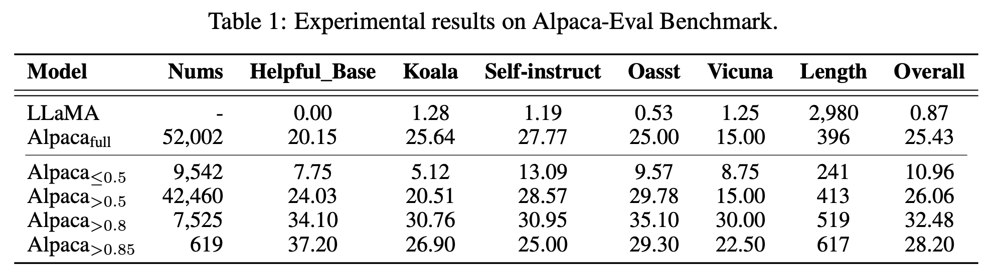
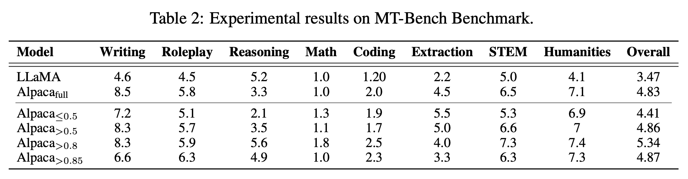

# One Shot Learning as Instruction Data Prospector for Large Language Models


## 🔥 Updates
- [**2023-12-16**]: 🧑🏻‍💻 code has been released on [GitHub](https://github.com/pldlgb/nuggets).
- [**2023-12-16**]: 📄 paper has been posted on [arXiv](https://arxiv.org/pdf/2312.10302.pdf).


## 🎧 Overview 
**NUGGETS**, a novel and efficient methodology that employs one shot learning to select high-quality instruction data from expansive datasets. 

Nuggets assesses the potential of individual instruction examples to act as effective one shot examples, thereby identifying those that can significantly enhance diverse task performance. Nuggets utilizes a scoring system based on the impact of candidate examples on the
perplexity of a diverse anchor set, facilitating the selection of the most beneficial data for instruction tuning. 

Through rigorous testing on two benchmarks, including MT-Bench and Alpaca-Eval, we demonstrate that instruction tuning with the top **1%** of Nuggets-curated examples substantially outperforms conventional methods that use the full dataset

## ⚡️ Quickstart
### Prepare Environment
First, you should set up a python environment. This code base has been tested under python 3.x, and we officially support python 3.8.
```bash
conda create -n nuggets python=3.7
cd nuggets # where contains 'requirements.txt'
pip install -r requirements.txt
```

### Golden Scoring
```bash
python instruction_main.py \
      --dataset alpaca --prompt_version default \
      --exemplar_method stratified --num_k_shots 1 \
      --model_type local --model_size 7b \
      --model_path $model_path \
      --prompt_path "datasets/alpaca_gpt4/alpaca_gpt4_data.json" \
      --test_path "datasets/alpaca_gpt4/alpaca_gpt4_kmeans_100.json" \
      --save_path "save/alpaca_gpt4/score" \
      --kv_iter 1 \
      --step_size 0.01 --momentum 0.9 \
      --batch_size $batch_size \
      --gpus $gpu \
      --start $start \ 
      --pace $pace 
```
### Alpaca Training
```bash
git clone https://github.com/tatsu-lab/stanford_alpaca.git
cd stanford_alpaca
``` 
🚵 Set **--model_name_or_path**，**--data_path** and **--output_dir** 
```
$ torchrun --nproc_per_node=8 --master_port=30342 train.py \
      --model_name_or_path $models/llama_converted \
      --data_path ../datasets/alpaca_gpt4/kmeans_100/alpaca_gpt4_0.85.json \
      --bf16 True \
      --output_dir $models/alpaca_0.85 \
      --num_train_epochs 3 \
      --per_device_train_batch_size 4 \
      --per_device_eval_batch_size 4 \
      --gradient_accumulation_steps 8 \
      --evaluation_strategy "no" \
      --save_strategy "steps" \
      --save_steps 2000 \
      --save_total_limit 1 \
      --learning_rate 2e-5 \
      --weight_decay 0. \
      --warmup_ratio 0.03 \
      --lr_scheduler_type "cosine" \
      --logging_steps 1 \
      --fsdp "full_shard auto_wrap" \
      --fsdp_transformer_layer_cls_to_wrap 'LlamaDecoderLayer' \
      --tf32 True
```
## Evaluation


### 🧷 Refer to [Alpaca_eval](https://github.com/tatsu-lab/alpaca_eval) and [MT-Bench](https://github.com/lm-sys/FastChat/blob/main/fastchat/llm_judge/README.md) for more details

## Citation 🤔

If you finding our work interesting or helpful to you, please cite this repo 😘.

```plain
@article{li2023one,
  title={One Shot Learning as Instruction Data Prospector for Large Language Models},
  author={Li, Yunshui and Hui, Binyuan and Xia, Xiaobo and Yang, Jiaxi and Yang, Min and Zhang, Lei and Si, Shuzheng and Liu, Junhao and Liu, Tongliang and Huang, Fei and others},
  journal={arXiv preprint arXiv:2312.10302},
  year={2023}
}
```
